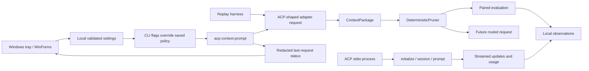

# Provisional Architecture

The current core deliberately stops before network or editor integration.

`tokenmill-cli::settings` owns local policy storage, atomic replacement, and OS-held settings/request locks.
`tokenmill-cli::tray` compiles its embedded WinForms C# source with the installed .NET Framework compiler and launches the native GUI only for the explicit `tray` command; headless commands require no GUI runtime.
`tokenmill-tray` is the console-free entry point, and `Start-Tokenmill.cmd` provides repository-local double-click launch.
The tray reads settings through the same CLI entry point used by automation and changes policy for subsequent `acp-context-prompt` requests only.
First initialization disables routing, while absent settings preserve historical CLI defaults.
The request lock serializes tracked context requests; process termination releases the lock, leaving incomplete redacted status rather than stale RUNNING state.
Tray policy does not affect raw prompts, paired evaluations, or external GitHub Copilot traffic.

The current `tokenmill-acp` crate is a normalized adapter boundary, replay harness, and small ACP JSON-RPC stdio process client.
The process client launches an explicitly configured agent, creates sessions, sends text prompts, collects streamed updates and usage updates, and cancels permission requests by default.
It does not intercept VS Code traffic, transform hidden Copilot context, or proxy client-side tools.

- `ContextPackage` is the protocol-neutral input boundary.
- `DeterministicPruner` is the first explainable saver.
- `ConsecutiveOutputCompactor` is an experimental local saver for repeated command/tool output; it is evaluated through core fixtures and is not yet the ACP default.
- `SaverReport` distinguishes estimated measurements and budget failures.
- `EvaluationResult` requires both token savings and task success.
- `RunPolicy` makes saver/routing toggles and strict/compatible behavior explicit.
- `Observation` records route, saver, measurement, and outcome fields without raw content.
- The replay harness proves policy behavior independently of live ACP transport.
- The live prompt path currently sends caller-supplied text and does not yet connect a transformed `ContextPackage` to GitHub Copilot's hidden repository context.
- The context prompt path can emit an explicit redacted JSONL observation; it does not persist raw context by default.
- `tokenmill-cli::view` validates redacted paired-history records into a shared `RedactedRunView` and `EvaluationHistorySummary` contract consumed by both history aggregation and the TUI.
- The CLI TUI renders the redacted paired-history summary locally, shows the latest run's evidence states, and provides refresh/quit controls without adding a network or desktop runtime.
- A single paired evaluation requires explicit task success and at least 15% estimated reduction before it is marked accepted; corpus-level median, task-success-rate, critical-failure, and latency checks remain unmeasured.
- `docs/fixtures/visual-evidence-history.jsonl` is a raw-content-free fixture for deterministic visual verification of accepted, rejected, unknown, unverified, unmeasured, and failed runs.
