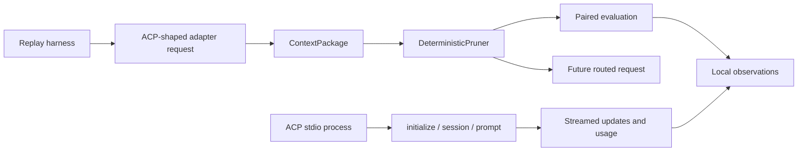

# Provisional Architecture

The current core deliberately stops before network or editor integration.

The current `tokenmill-acp` crate is a normalized adapter boundary, replay harness, and small ACP JSON-RPC stdio process client.
The process client launches an explicitly configured agent, creates sessions, sends text prompts, collects streamed updates and usage updates, and cancels permission requests by default.
It does not intercept VS Code traffic, transform hidden Copilot context, or proxy client-side tools.

- `ContextPackage` is the protocol-neutral input boundary.
- `DeterministicPruner` is the first explainable saver.
- `SaverReport` distinguishes estimated measurements and budget failures.
- `EvaluationResult` requires both token savings and task success.
- `RunPolicy` makes saver/routing toggles and strict/compatible behavior explicit.
- `Observation` records route, saver, measurement, and outcome fields without raw content.
- The replay harness proves policy behavior independently of live ACP transport.
- The live prompt path currently sends caller-supplied text and does not yet connect a transformed `ContextPackage` to native Copilot's hidden repository context.
- The context prompt path can emit an explicit redacted JSONL observation; it does not persist raw context by default.
